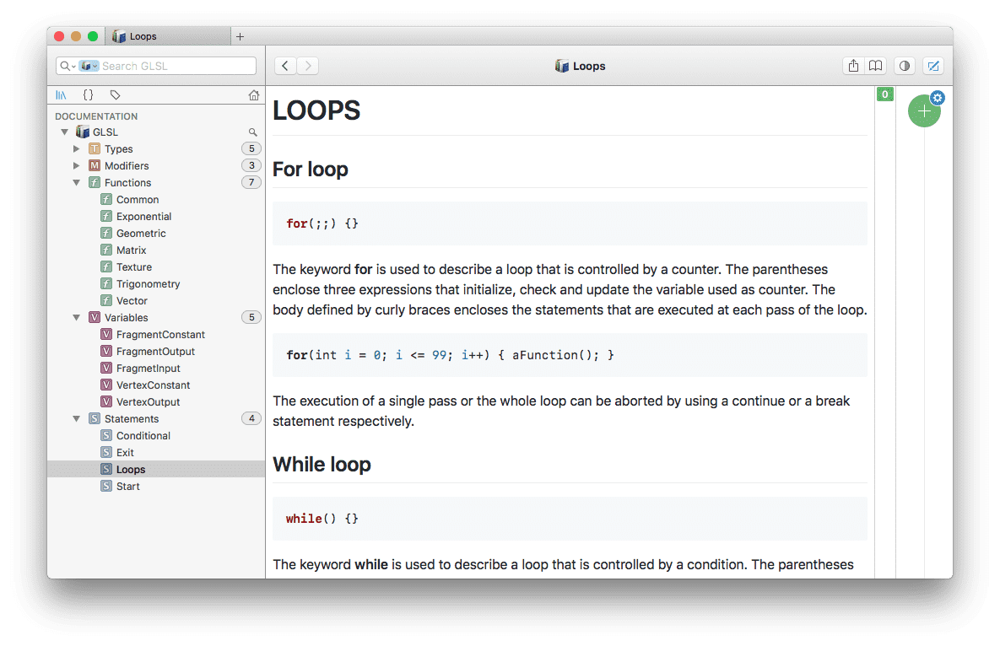

# GLSL Docset for Dash

This manual was created by [Shaderific](http://www.shaderific.com/glsl/).

I enjoy shader programming and love this awesome manual which is better than the official terrible and unreadable [documentation](https://www.khronos.org/registry/OpenGL/index_gl.php).

I had to leave the manual's webpage open when I was writing GLSL code. However I get used to search API in [Dash](https://kapeli.com/dash) which is a de rigueur helper to developers all over the world. So why not make it a Dash docset?

1. First I write anothor small [tool](https://github.com/eyworldwide/markdown2dash) to convert markdown files to Dash docset. 
2. Then split the original articles to fragments so I can find the target API more quickly.
3. Also add some 'github' flavor to the doc style to make it prettry.

Thank Shaderific again!

